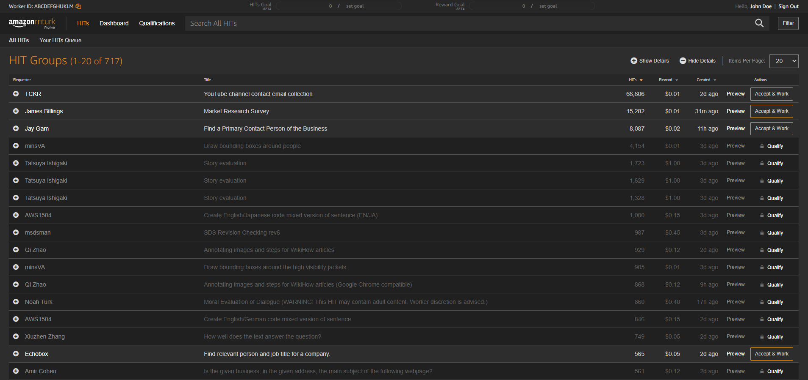

# MTurk Dark Theme

> This theme was cloned from https://userstyles.org/styles/149148/mturk-worker-site-dark-theme-beta due to extremely slow load times on UserStyles. Some slight modifications were made to the original theme.

    </img>

**Step 1:** Install [Stylus](https://add0n.com/stylus.html) for either [Firefox](https://addons.mozilla.org/en-US/firefox/addon/styl-us/), [Chrome](https://chrome.google.com/webstore/detail/stylus/clngdbkpkpeebahjckkjfobafhncgmne) or [Opera](https://addons.opera.com/en-gb/extensions/details/stylus/)

**Step 2:** [Install the style usercss](https://github.com/nick-w-nick/mturk-dark-theme/raw/main/mturk-dark-theme.user.css)